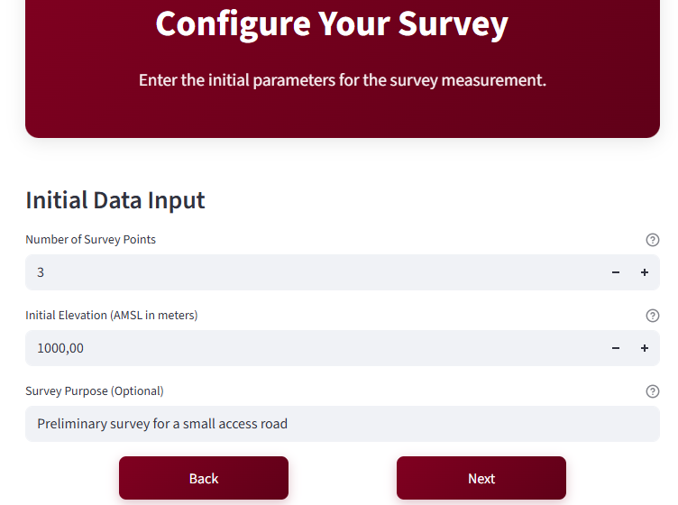
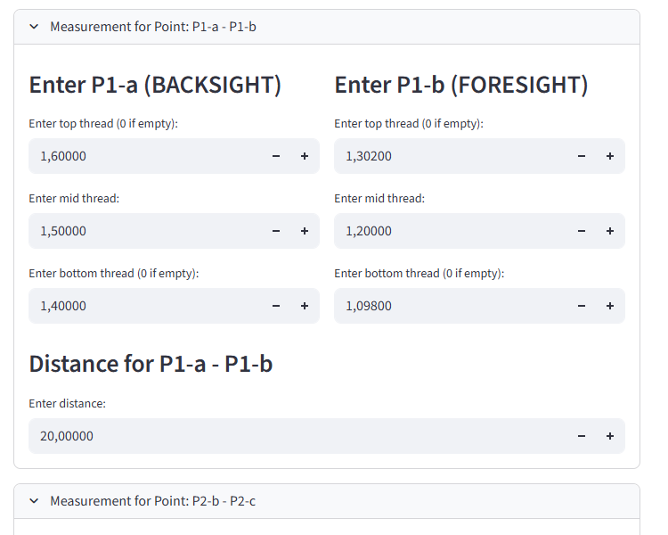
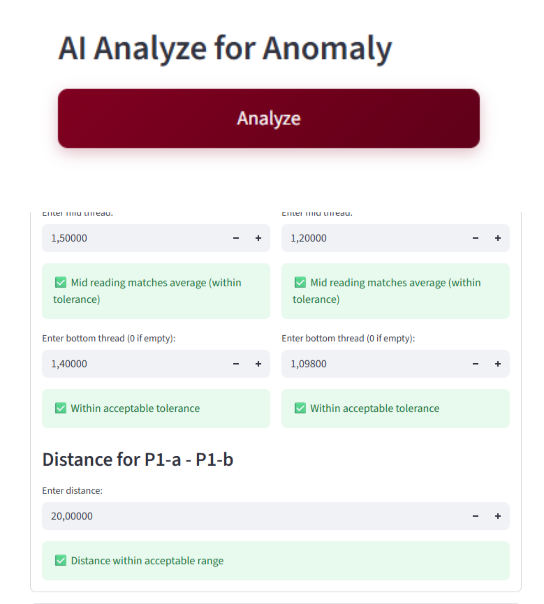
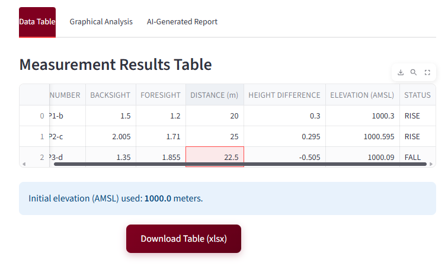
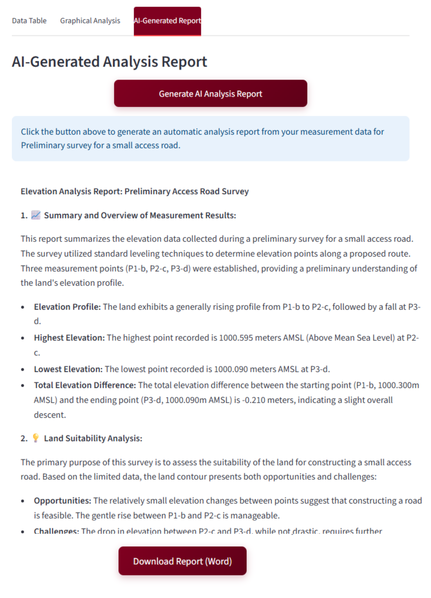

# Survey Measurement Web App with AI
*by Dimas S.P*  
(Vocational High School Student – Modeling Design & Building Information)

---

[](https://python.org)
[](https://streamlit.io)
[](https://opensource.org/licenses/MIT)

A modern web application for processing and analyzing land survey data, featuring AI-powered anomaly detection and report generation using the Google Gemini API.

---

### 📜 Evolusi Proyek

Aplikasi web ini adalah reimaginasi modern dari proyek aplikasi desktop yang saya bangun sebelumnya. Proyek ini dikembangkan untuk menerapkan teknologi web seperti Streamlit dan integrasi AI.

**Untuk melihat perjalanan pengembangan dari versi command-line (v1.0) hingga menjadi aplikasi desktop (v4.0), Anda bisa mengunjungi repositori pendahulunya di sini: [Survey-Measurement-Desktop](https://github.com/Dimas-SP08/Land-Measurement-code)**

---

## ✨ Fitur Utama

- **Antarmuka Web Interaktif**: Dibangun dengan Streamlit untuk kemudahan penggunaan di browser apa pun.
- **Kalkulasi Otomatis**: Menghitung elevasi, beda tinggi, dan status (RISE/FALL/FLAT) secara otomatis.
- **🤖 Integrasi AI Gemini**:
    - Mendeteksi anomali atau potensi kesalahan dalam data pengukuran.
    - Menghasilkan laporan survei profesional secara otomatis.
- **Visualisasi Data Dinamis**: Menampilkan grafik profil elevasi dan beda tinggi yang interaktif.
- **Ekspor Hasil Profesional**:
    - Unduh laporan dalam format **Word (.docx)** yang dihasilkan oleh AI.
    - Ekspor data dan grafik ke **Excel (.xlsx)**.
    - Simpan plot sebagai gambar **PNG**.

---

## 🚀 Cara Kerja Aplikasi

### Langkah 1: Memulai Survei
Klik tombol **"Start Survey Now"** untuk memulai.


---

### Langkah 2: Input Parameter Awal
Masukkan jumlah titik pengukuran, elevasi awal (AMSL), dan tujuan survei.


---

### Langkah 3: Input Data Pengukuran
Isi data benang atas, tengah, bawah, serta jarak antar titik.


---

### Langkah 4: Analisis Anomali dengan AI
Gunakan Gemini AI untuk meninjau data Anda dan mendeteksi potensi anomali.


---

### Langkah 5: Lihat Hasil Tabel & Grafik
Periksa hasil perhitungan dalam bentuk tabel yang rapi dan visualisasi grafik yang interaktif.


---

### Langkah 6: Hasilkan Laporan AI
Buat ringkasan dan laporan survei profesional dengan satu kali klik menggunakan kekuatan AI.


---

## 🛠️ Teknologi yang Digunakan
- **Python**: Bahasa pemrograman utama.
- **Streamlit**: Untuk membangun antarmuka aplikasi web interaktif.
- **Pandas**: Untuk manipulasi dan analisis data.
- **Matplotlib**: Untuk membuat visualisasi data.
- **Google Gemini API**: Untuk fitur deteksi anomali dan pembuatan laporan AI.
- **openpyxl**: Untuk menangani file Excel.
- **python-docx**: Untuk menghasilkan dokumen Word.
- **Pillow**: Untuk pemrosesan gambar.

---

## ⚙️ Instalasi & Cara Menjalankan Lokal

Untuk menjalankan aplikasi ini di komputer Anda, ikuti langkah-langkah berikut:

**1. Clone Repositori**
```bash
git clone [https://github.com/USERNAMEANDA/Survey-Measurement-WebApp.git](https://github.com/USERNAMEANDA/Survey-Measurement-WebApp.git)
cd Survey-Measurement-WebApp